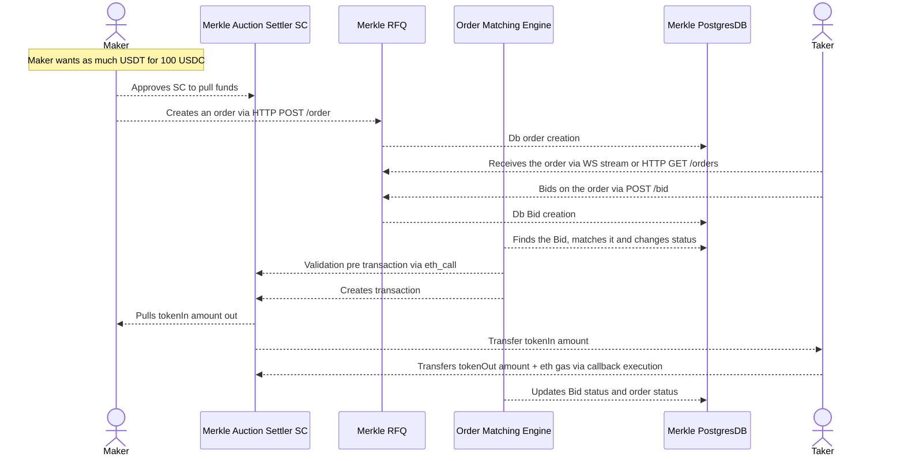

```mermaid
sequenceDiagram
    actor Maker
    participant Merkle Auction Settler SC
    participant Merkle RFQ
    participant Order Matching Engine
    participant Merkle PostgresDB
    actor Taker

    Note over Maker: Maker wants as much USDT for 100 USDC

    Maker -->> Merkle Auction Settler SC: Approves SC to pull funds
    Maker -->> Merkle RFQ: Creates an order via HTTP POST /order
    Merkle RFQ -->> Merkle PostgresDB: Db order creation
    Taker -->>  Merkle RFQ: Receives the order via WS stream or HTTP GET /orders
    Taker -->> Merkle RFQ: Bids on the order via POST /bid
    Merkle RFQ -->> Merkle PostgresDB: Db Bid creation
    Order Matching Engine -->> Merkle PostgresDB: Finds the Bid, matches it and changes status
    Order Matching Engine -->> Merkle Auction Settler SC: Validation pre transaction via eth_call
    Order Matching Engine -->> Merkle Auction Settler SC: Creates transaction
    Merkle Auction Settler SC -->> Maker: Pulls tokenIn amount out
    Merkle Auction Settler SC -->> Taker: Transfer tokenIn amount
    Taker -->> Merkle Auction Settler SC: Transfers tokenOut amount + eth gas via callback execution
    Order Matching Engine -->> Merkle PostgresDB: Updates Bid status and order status

```
